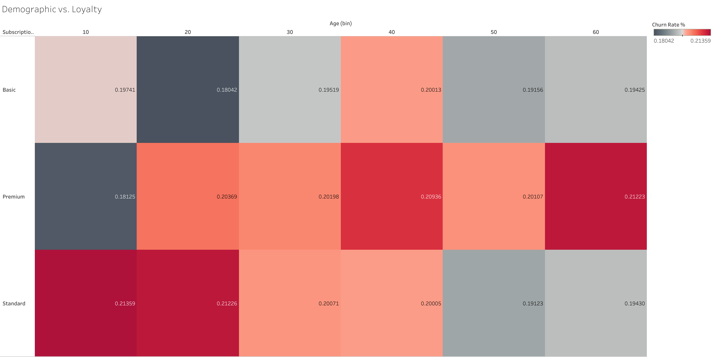
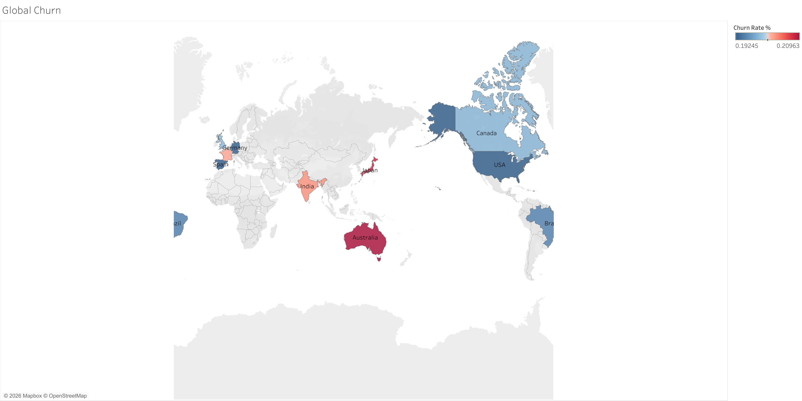
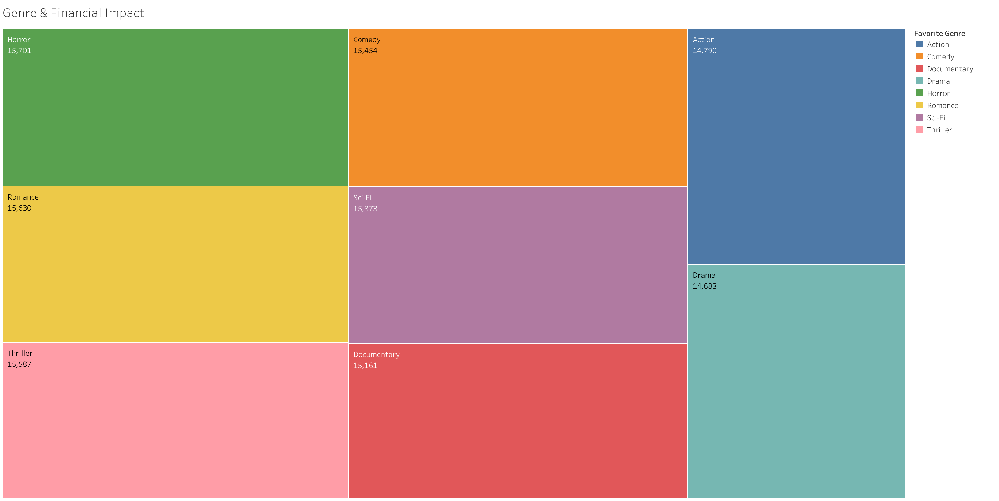
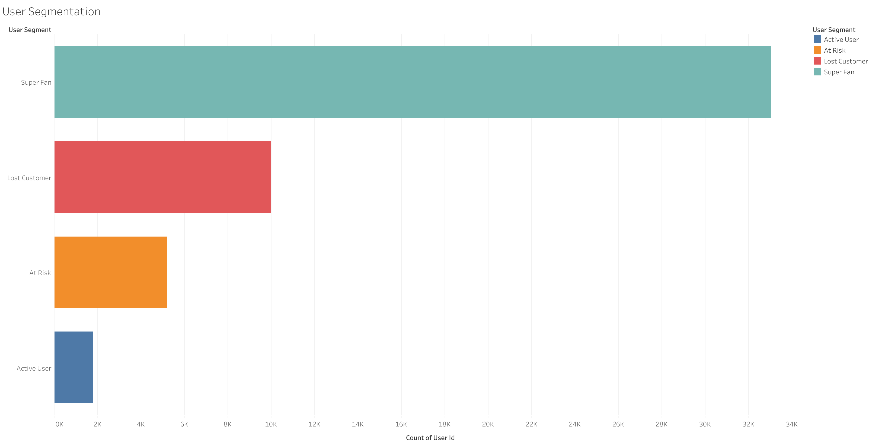
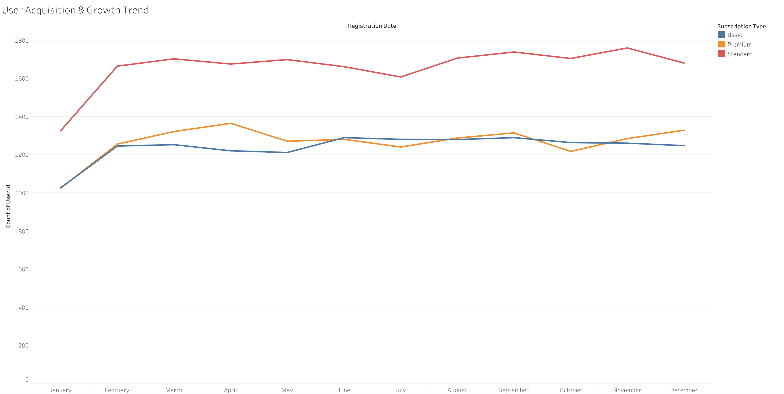

# Netflix Subscription Lifecycle & Engagement Optimization

**Churn driver analysis of 50,000 streaming subscribers**

What drives churn among 50,000 streaming subscribers, and what only looks like it does? This project tests every available field against churn, checks whether the hot spots in the charts survive statistical scrutiny, validates a lifecycle segmentation, and sizes the revenue at stake. The main result is a negative one, reported plainly: nothing in this dataset explains churn, so the right next step is an experiment, not a targeting campaign.

| Users | Churned | Monthly recurring revenue | Fields |
| :--- | :--- | :--- | :--- |
| 50,000 | 19.9% (9,964 users) | $616K | 20 fields: demographics, plan, engagement, behavior |

> **Data note.** The dataset is synthetic. It is not real Netflix data. Its fields are almost all evenly distributed and independent of churn, so the null result describes this dataset and may not transfer to a real subscriber base.

## Contents

- [Executive summary](#executive-summary)
- [Business questions](#business-questions)
- [Dataset](#dataset)
- [Methodology](#methodology)
- [Findings](#findings)
- [Recommendations](#recommendations)
- [Limitations](#limitations)
- [Reproduce](#reproduce)

## Executive summary

About one in five subscribers has churned, and none of the demographic, content or engagement fields explains who. Several charts appear to show hot spots, but each one is within what chance alone produces.

1. **Churn is 19.9% and costs $122K of the $616K monthly recurring revenue.** Churned and active users pay the same on average, so revenue churn equals user churn. Each percentage point of churn is worth about $6.2K MRR, or $74K a year.
2. **No field separates churned users from active ones.** Nineteen tests were run across demographics, plan, content and behavior. One was nominally significant (plan, p = 0.033) and it disappears after correction (p = 0.62). Two models using every field at once score a cross-validated AUC of 0.50.
3. **The hot spots in the charts are noise.** The age-by-plan heatmap spans 18.0% to 21.4%, but shuffled labels produce a spread that large or larger more than half the time (p = 0.54). Country churn (19.2% to 21.0%) and lost revenue by genre ($14.7K to $15.7K) are equally flat.
4. **The segmentation is descriptive, not predictive.** "Super Fan" covers 66% of users because the 60-minute watch threshold is only the 18th percentile. The At Risk profile (5,201 users, $64K MRR) does not predict churn on its own (20.5% versus 19.8%, p = 0.19).
5. **The January dip in the acquisition chart is an artifact.** Registration dates are reconstructed from account age, and one calendar month gets four cohorts instead of five, a 20% shortfall by construction.
6. **The evidence supports an experiment, not targeting.** The tests could detect gaps of about 1 to 2 points, so any real driver in this data is small.

> **Bottom line.** Do not target retention spend by demographics or genre. Test a retention offer on the At Risk audience against a holdout group, and collect the fields that could actually explain churn.

## Business questions

1. How large is churn, and how much revenue does it take?
2. Which customers churn: is it explained by demographics, plan, content or engagement?
3. Do the apparent patterns in the charts hold up statistically?
4. Does the lifecycle segmentation identify users who are actually at risk?
5. What is a point of churn worth, and what should be tested next?

## Dataset

One row per user (`user_id` is unique), 20 fields in five groups.

| Group | Fields |
| :--- | :--- |
| Identity and demographics | `user_id`, `age`, `gender`, `country` |
| Subscription | `subscription_type`, `monthly_fee`, `payment_method`, `account_age_months` |
| Device and content | `primary_device`, `devices_used`, `favorite_genre` |
| Engagement | `avg_watch_time_minutes`, `watch_sessions_per_week`, `binge_watch_sessions`, `completion_rate`, `rating_given`, `content_interactions`, `recommendation_click_rate`, `days_since_last_login` |
| Outcome | `churned` (Yes or No) |

### Data quality checks

| Check | Result |
| :--- | :--- |
| Uniqueness | No duplicate `user_id` and no duplicate rows. |
| Completeness | No missing values in any field. |
| Ranges | Age 18 to 64, account age 1 to 59 months, days since last login 0 to 59, average watch time 10 to 299 minutes. |
| Shape of the data | Eight of nine numeric fields are statistically consistent with a uniform distribution, and all categories are evenly balanced (goodness-of-fit p above 0.30). This is typical of generated data and shapes how the results should be read. |
| Fee versus plan | `monthly_fee` takes three values (7.99, 12.99, 15.99) but is unrelated to `subscription_type` (Kruskal-Wallis p = 0.88). A Premium user is as likely to pay 7.99 as 15.99. |
| Registration date | The source has no registration date. The acquisition chart derives one from `account_age_months` (see finding 6). |

## Methodology

- **Definitions.** *Churned* is the `churned` flag. *MRR* is the sum of `monthly_fee`. Age bins are 10 years wide as in the heatmap, where the bin labeled 10 holds ages 18 and 19 only.
- **Tests.** Chi-square for churn across categories, Mann-Whitney (reported as AUC, where 0.5 means no separation) for numeric fields, a permutation test for the heatmap spread, and goodness-of-fit tests for the shape of the data.
- **Multiple testing.** Nineteen hypothesis tests were run, so a Holm correction is applied. A nominal p-value below 0.05 is only called a finding if it survives the correction.
- **Predictive check.** Logistic regression and gradient boosting with all fields, five-fold cross-validated AUC, seed 42.
- **Power.** Minimum detectable gaps are reported so that non-significant results can be read correctly.
- **Tools.** Python (pandas, SciPy, statsmodels, scikit-learn) for testing and modeling, Tableau for the charts.
- **Reproducibility.** Every figure in this README is produced by [`analysis/netflix_churn_analysis.ipynb`](analysis/netflix_churn_analysis.ipynb).

## Findings

### 1. Churn is about 20% in every plan and age group



*Figure 1. Churn rate by subscription plan and age bin.*

| Plan | Users | Churn rate |
| :--- | ---: | ---: |
| Standard | 19,931 | 20.1% |
| Premium | 15,196 | 20.4% |
| Basic | 14,873 | 19.2% |

- Overall churn is 19.93% (9,964 of 50,000). By plan it runs from 19.2% to 20.4% (chi-square p = 0.033, Holm-adjusted p = 0.62).
- The heatmap has 18 cells ranging from 18.0% to 21.4%, a spread of 3.3 points. Shuffling churn labels across users produces a median spread of 3.4 points and a 95th percentile of 5.4, so the observed spread is what chance produces (permutation p = 0.54). A chi-square test across the 18 cells agrees (p = 0.18).
- The most extreme cells are the smallest. Age bin 10 (ages 18 and 19) has 618 to 824 users per cell, against up to 4,349 elsewhere.
- The color scale runs only from 18.0% to 21.4%, which makes small gaps look large.

> **Implication.** Plan and age do not explain churn. Treat the darkest cells as noise, not as segments to target.

### 2. Country differences are within the margin of error



*Figure 2. Churn rate by country.*

| Country | Users | Churn rate | 95% margin of error |
| :--- | ---: | ---: | ---: |
| Australia | 5,004 | 21.0% | +/- 1.1 pts |
| Japan | 4,907 | 20.8% | +/- 1.1 pts |
| India | 5,028 | 20.3% | +/- 1.1 pts |
| France | 4,919 | 20.2% | +/- 1.1 pts |
| UK | 4,929 | 19.9% | +/- 1.1 pts |
| Canada | 4,959 | 19.8% | +/- 1.1 pts |
| Brazil | 5,116 | 19.5% | +/- 1.1 pts |
| Spain | 5,027 | 19.3% | +/- 1.1 pts |
| Germany | 5,024 | 19.3% | +/- 1.1 pts |
| USA | 5,087 | 19.2% | +/- 1.1 pts |

- Churn ranges from 19.2% (USA) to 21.0% (Australia). Each country has about 5,000 users, so each rate carries a margin of error of about 1.1 points, and the differences are not significant (chi-square p = 0.26).
- Australia is the closest to a signal: 21.0% versus 19.8% for all other countries (p = 0.056), which is inconclusive.
- The map's color scale spans only 1.7 points, so the gradient overstates the differences.

> **Implication.** No market needs a separate retention plan on this evidence. Australia is worth watching, not acting on.

### 3. Genre losses are flat because genres are the same size



*Figure 3. Monthly revenue lost to churned users, by favorite genre (USD).*

| Favorite genre | Users | Churn rate | Lost MRR | Share of lost MRR |
| :--- | ---: | ---: | ---: | ---: |
| Horror | 6,223 | 20.3% | $15,701 | 12.8% |
| Romance | 6,282 | 20.2% | $15,630 | 12.8% |
| Thriller | 6,257 | 20.5% | $15,587 | 12.7% |
| Comedy | 6,259 | 20.1% | $15,454 | 12.6% |
| Sci-Fi | 6,189 | 19.9% | $15,373 | 12.6% |
| Documentary | 6,352 | 19.7% | $15,161 | 12.4% |
| Action | 6,235 | 19.3% | $14,790 | 12.1% |
| Drama | 6,203 | 19.4% | $14,683 | 12.0% |

- Lost revenue ranges from $14.7K to $15.7K. Horror is the largest at 12.8% of the total, against an equal share of 12.5%.
- Genres have almost the same number of users and the same churn rate (19.3% to 20.5%, chi-square p = 0.63), so the treemap shows user counts, not risk.
- Churned users pay the same as active users ($12.28 versus $12.33 a month), so lost revenue tracks lost users.

> **Implication.** Genre-level content or pricing changes cannot be justified by revenue at risk.

### 4. No engagement or behavior field predicts churn

| Field | Churned (mean) | Active (mean) | AUC | Holm-adjusted p |
| :--- | ---: | ---: | ---: | ---: |
| Age | 40.91 | 41.00 | 0.498 | 1.00 |
| Account age (months) | 29.64 | 29.93 | 0.495 | 1.00 |
| Average watch time (min) | 154.10 | 155.16 | 0.496 | 1.00 |
| Watch sessions per week | 9.95 | 10.00 | 0.497 | 1.00 |
| Binge sessions | 6.97 | 7.01 | 0.498 | 1.00 |
| Completion rate (%) | 64.46 | 64.55 | 0.499 | 1.00 |
| Rating given | 3.01 | 3.00 | 0.502 | 1.00 |
| Content interactions | 24.11 | 24.35 | 0.495 | 1.00 |
| Recommendation click rate (%) | 49.43 | 49.60 | 0.498 | 1.00 |
| Days since last login | 29.43 | 29.41 | 0.500 | 1.00 |
| Monthly fee ($) | 12.28 | 12.33 | 0.496 | 1.00 |

- Every numeric field has an AUC between 0.495 and 0.502, and the churned and active means differ by about 1% or less. After the Holm correction every p-value is 1.00.
- Across all 19 tests, one was nominally significant (plan, p = 0.033). At the 0.05 level, one false positive in 19 tests is expected by chance.
- Logistic regression and gradient boosting, given every field at once, reach a cross-validated AUC of 0.501 and 0.498. That is no better than a coin flip.
- The tests can detect gaps of about 1 to 2 points, so a real effect of that size would have appeared:

| Comparison | Group size | Minimum detectable churn gap |
| :--- | ---: | ---: |
| Two halves of the user base | 25,000 | 1.0 points |
| One plan versus the rest | about 15,000 | 1.1 points |
| One country versus the rest | about 5,000 | 1.7 points |
| A group the size of At Risk | 5,201 | 1.6 points |
| The smallest heatmap cell | about 620 | 4.5 points |

> **Implication.** Watch time, sessions, completion, ratings and recency do not indicate who will churn here. Any real driver is small or is not captured by these fields.

### 5. The segmentation describes users but does not predict risk



*Figure 4. Users by lifecycle segment.*

| Segment | Rule | Users | Share of users | MRR | Share of MRR |
| :--- | :--- | ---: | ---: | ---: | ---: |
| Super Fan | Not churned, average watch time above 60 minutes | 33,025 | 66.0% | $407,540 | 66.1% |
| Lost Customer | Churned | 9,964 | 19.9% | $122,380 | 19.9% |
| At Risk | Not churned, watch time 60 minutes or less, last login more than 14 days ago | 5,201 | 10.4% | $64,037 | 10.4% |
| Active User | Not churned, watch time 60 minutes or less, last login within 14 days | 1,810 | 3.6% | $22,210 | 3.6% |

- **Super Fan is a low bar.** 60 minutes is the 18th percentile of average watch time, so 82.5% of active users qualify.
- **At Risk is not a validated risk score.** Applying the At Risk profile (low watch time and inactive for more than 14 days) to all users, 6,545 match it, and they churn at 20.5% against 19.8% for everyone else (p = 0.19). Low watch time alone (p = 0.60) and inactivity alone (p = 0.81) do not predict churn either.
- **It is still a reasonable pilot audience.** The 5,201 At Risk users hold $64K of MRR (10.4% of the total).

> **Implication.** Use At Risk as the audience for a controlled retention test, not as a score that ranks who will leave. Rebuild the thresholds on percentiles and validate them against churn before relying on them.

### 6. The January dip in the acquisition chart is an artifact



*Figure 5. Registered users by calendar month and plan, with registration month reconstructed from account age.*

- The dataset has no registration date. The chart derives one from `account_age_months`, which is uniform from 1 to 59 months (goodness-of-fit p = 0.77).
- 59 is not a multiple of 12, so calendar months are not equally represented. Account ages 12, 24, 36 and 48 map back to the snapshot month itself, which therefore gets four cohorts of account age while every other month gets five.
- That month holds 3,378 users against an average of 4,238 for the others, a ratio of 0.80, essentially the 4 to 5 that the construction predicts. This is the January dip in the chart.
- Outside that month the line is flat, so no acquisition trend can be read from this field.

> **Implication.** Do not report acquisition growth or seasonality from this chart. A native signup date is needed.

## Recommendations

| # | Recommendation | Evidence | Expected impact | Confidence |
| :--- | :--- | :--- | :--- | :--- |
| 1 | **Do not fund demographic, country or genre targeted retention from this data.** | 19 tests, none significant after correction. Two models score an AUC of 0.50. | Avoids spend with no evidence base. | High |
| 2 | **Run a randomized retention test on the At Risk audience, with a holdout group.** | 5,201 users and $64K MRR. The profile is not validated as a risk score (churn 20.5% versus 19.8%, p = 0.19). | Measures true incremental retention. Each point of churn is worth about $6.2K MRR. | Medium (effect size unknown) |
| 3 | **Collect the fields that could explain churn.** Cancellation reason, billing failures, price changes, support contacts, content availability and the exact churn date. | The available fields carry no signal. | Makes driver and survival analysis possible. | High |
| 4 | **Rebuild segments on percentile thresholds and validate them against churn before use.** | 60 minutes is the 18th percentile, so Super Fan covers 82.5% of active users. | Segments that actually separate risk. | Medium |
| 5 | **Fix the data definitions.** Align fee with plan, add a native signup date, and define the churn window. | Fee is unrelated to plan (p = 0.88). The January dip is an artifact. | Reliable revenue and cohort analysis. | High |

## Limitations

- **Synthetic data.** Fields are almost all uniform and independent of churn. The null result may reflect how the data was generated, not how real subscribers behave, so the method is the transferable part.
- **Churn is undefined in time.** The `churned` flag has no date or observation window, so survival, cohort retention and time-to-churn cannot be analyzed.
- **Fee is unrelated to plan.** Revenue figures use `monthly_fee` as given, and plan-level revenue conclusions would not be meaningful.
- **Non-significant does not mean no effect.** Gaps below about 1 to 2 points, or in groups smaller than a few thousand users, could not be detected.
- **Observational data.** The analysis shows association only. The retention test recommended above is what would establish causation.
- **Segment rules.** The segment thresholds (60 minutes, 14 days) are fixed cut-offs documented in the notebook, and they reproduce the counts in Figure 4 exactly.

## Next steps

- Design the retention test: randomize the At Risk audience into offer and holdout groups, and measure incremental retention rather than raw churn.
- Add cancellation reasons, billing events, price changes and support contacts, then repeat the driver analysis.
- Add a signup date and churn date to enable cohort retention and survival analysis.
- Replace fixed thresholds with percentile-based segments and validate them against churn.

## Reproduce

```bash
pip install -r requirements.txt
jupyter notebook analysis/netflix_churn_analysis.ipynb
```

Run all cells from top to bottom. The notebook reproduces every number quoted above, grouped by section, and its saved outputs are already visible on GitHub without running anything.

### Repository structure

```
.
├── README.md
├── requirements.txt
├── netflix_user_behavior_dataset.csv
├── analysis/
│   └── netflix_churn_analysis.ipynb
├── demographic-vs-loyalty.png
├── global-churn.png
├── genre-financial-impact.png
├── user-segmentation.png
└── user-acquisition-growth-trend.png
```
